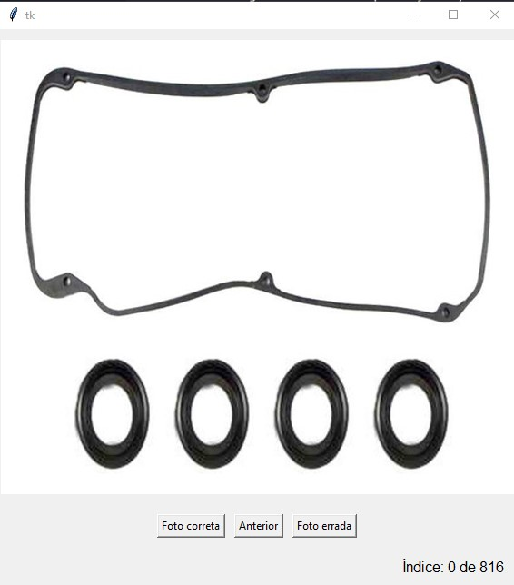

# GUI Tkinter

O código define uma aplicação Python utilizando Tkinter para a interface gráfica, PIL para manipulação de imagens e pandas para manipulação de dados. O objetivo da aplicação é verificar fotos ao iterar por um DataFrame, permitindo que os usuários marquem fotos como corretas ou incorretas e naveguem entre elas. Aqui está uma visão geral de como cada parte do código funciona.

## Funcionalidades

1. **Inicialização da Classe (`App`)**:
    - A classe começa com várias variáveis de classe para gerenciar o estado da aplicação, como caminhos, DataFrames padrão, elementos da GUI e configurações de índice.

1. **Métodos de Gerenciamento de Dados**:
    - `created_new_dataframe`: Gera um novo DataFrame listando todos os arquivos de fotos em um diretório, extrai detalhes dos nomes dos arquivos e salva o DataFrame tanto como um arquivo `.feather` quanto `.csv`.
    - `ler_dataframe`: Carrega um DataFrame existente de um arquivo `.feather` e configura o DataFrame para iterar através de fotos não verificadas.

2. **Gerenciamento de Índices**:
    - `__mudar_indices`: Um método para atualizar a configuração dos índices.
    - `__alternar_indice`: Ajusta o índice atual com base na interação do usuário para avançar ou retroceder na lista de fotos.

3. **Exibição de Imagens**:
    - `__mostrar_imagem`: Gerencia o carregamento e redimensionamento da imagem atual do DataFrame e atualiza a GUI para exibir a imagem.
    - `__mostrar_indices`: Atualiza a GUI para mostrar o índice atual da foto.

4. **Interação com a GUI**:
    - `__janela`: Gerencia as interações da GUI, como responder aos cliques dos botões. Atualiza o DataFrame com base em se uma foto é marcada como correta, incorreta ou se o usuário deseja voltar a uma foto anterior.
    - O tratamento de erros está incluído para quando o usuário tenta navegar além do intervalo disponível de fotos.

5. **Execução Principal**:
    - O método `main` configura o estado inicial da GUI, botões e lança o loop de eventos principal do Tkinter.
    - Este método é ativado na última parte do script, que verifica se o script está sendo executado como o programa principal.

6. **Caminho do Arquivo e Validação de Fotos**:
    - Presume-se que as fotos estejam em um subdiretório `out_files_photos` relativo ao local do script. O nome de cada arquivo de foto é dividido para extrair metadados presumivelmente usados para validação.

7. **Componentes da GUI Tkinter**:
    - A GUI utiliza botões para interagir com o usuário, permitindo que validem cada foto como correta ou incorreta, ou para navegar de volta a uma foto anterior.

Este script é projetado para fornecer uma interface direta para tarefas de verificação de fotos, particularmente útil para tarefas como validar conjuntos de dados de imagens. Ele combina interação GUI com manipulação de dados de forma que usuários não técnicos possam operar, o que é crucial para tarefas que envolvem a verificação manual de numerosos itens como fotos.
