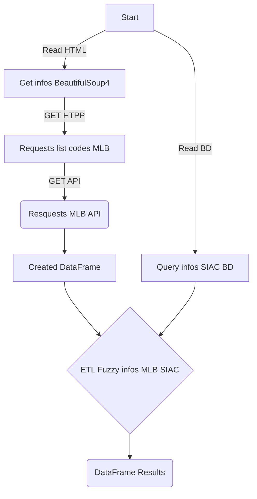

# Match Market Ads

O objetivo desse projeto, e clonar anuncios do Mercado Livre, sendo eles de lojas oficiais.
Basicamente e identinficar se o produto e o mesmo de tal loja oficial, seguindo alguns parametros.

## Funcionalidades

1. [x] Baixar lista de lojas oficiais existentes no Mercado Livre;
2. [x] Abrir site geral das lojas oficiais, para categorias Acessórios para Veículos;
3. [x] Pega cada loja oficial da lista;
4. [x] Cruzar com nossa lista de marcas (usar FUZZY 60%) com nomes de loja oficiais;
5. [x] Validar manualmente e apontar a lista de marcas e os respectivos SKUs ativos;
6. [x] Pegar todos os produtos de uma determinada loja oficial, via HTML (WebScrapping);
7. [x] Pegar a lista do 4º passo, e avaliar o nível de matches, por cada categoria a seguir:
8. [x] GTIN (EAN) - Concorrente <=> GTIN (EAN) - SIAC;
9. [x] MPN - Concorrente <=> MPN – SIAC\Fraga;
10. [x] SKU – Concorrente <=> SKU – SIAC;
11. [x] OEM|MARCA – Concorrente <=> OEM|MARCA – SIAC;
12. [x] Criar uma planilha com os resultados acima;
13. [ ] Baixar todos os atributos do anúncio concorrente, substituir os atributos padrões como: vídeo, fotos, código referencia (SKU), marca, descrição;
14. [ ] Criar um Tkinter, para validacao das imagens;
15. [ ] Subir as fotos validadas e ligar o anúncio;

## Mermeid



## Exemplo da tabela

|mlb|gtin_ml|gtin_siac|gtin_fuzzy|mpn_ml|mpn_siac|mpn_fuzzy|
|---|-------|---------|----------|------|--------|---------|
|MLB4050163300|7899723815588|7899723815588|100|ASHY24050|ASHY24050|100|
|MLB3141414637|7899723833681|7899723833681|100|BCVW20025|BCVW20J025|95|

### Tipo de dados

```json
    {
        "lista_infos_mlb": "str",
        "lista_att_necessarios": "str",
        "mlb": "str",
        "gtin_ml": "str",
        "gtin_siac": "str",
        "gtin_fuzzy": "float",
        "mpn_ml": "str",
        "mpn_siac": "str",
        "mpn_fuzzy": "float",
        "sku_ml": "str",
        "sku_siac": "str",
        "sku_fuzzy": "float",
        "numero_original_ml": "str",
        "numero_original_siac": "str",
        "numero_original_fuzzy": "str",
        "marca_ml": "str",
        "marca_siac": "str",
        "marca_fuzzy": "float",
        "lista_url_anuncios": "str",
        "lista_mlb": "str",
        "soma_fuzzy": "float"
    }
```
